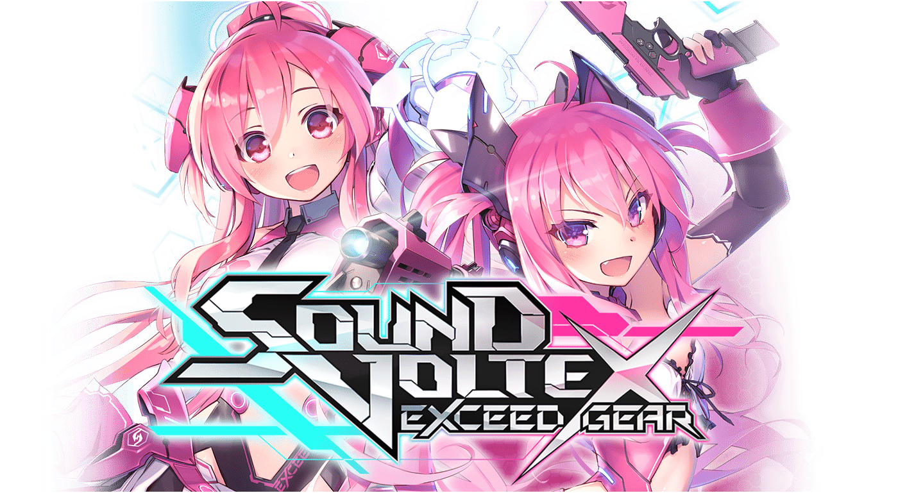

<center>

</center>

# AP Manual World for SOUND VOLTEX

Focused on EXCEED GEAR KONASUTE ver.

## Setup

> [!warning]
>
> This guide assumes some familiarity with setting up and using [Archipelago](https://archipelago.gg).
>
> If this is your first time using AP, I would recommend [reading the setup guide](https://archipelago.gg/tutorial/Archipelago/setup_en), then play with [an officially supported game first](https://archipelago.gg/games) to get a feel for how it works.

### Links

1. Download the Manual client [here](https://github.com/ManualForArchipelago/Manual/releases/latest)

   For more info on Manual and how to use it, join the Discord: https://discord.gg/T5bcsVHByx

1. Get the SOUND VOLTEX world and config from [downloads](../../../downloads).

Optional, but **highly** recommended:

1. Install [Universal Tracker](https://github.com/FarisTheAncient/Archipelago/releases/latest)

1. Download the [AP client font patch](../../../downloads/archipelago_noto_sans_jp_fonts.zip) to support special characters

### Config

**Make sure to adjust your YAML settings for your skill level.** The defaults will likely not work for you. See the comments in the YAML file for what each option does.

For a solo randomizer, I recommend ensuring you can get an S rank on about 20% of your songs, to ensure you can progress early.

For a multi, since others will lower your pass requirement for you, you can increase the overall difficulty of your pool:

- For your easier songs, you should be able to get AAA rank or higher (and ideally S or AAA+ on a handful of them)
- For your harder songs, you should be able to get A+ rank or higher

Adjust these recommendations accordingly [if you start with a lower Progressive Gate requirement](#decreasing-initial-pg).

## How to Play

The manual chooses a random selection of charts to play throughout the multi. Each chart has two locations:

- **HP Clear**: Requires an EFFECTIVE RATE 70% pass
- **Score Clear**: Requires a grade according to your current [Progressive Gate](#progressive-gate) requirement

> [!tip]
>
> **You can clear both locations for a chart with a single play!**
>
> The optimal strategy is to always try to clear 2 locations at a time. If you miss a clear, skip it and move onto a chart you haven't played yet.

### CHAIN

CHAIN items are your victory items; you need to collect a certain number of them to reach your goal (these are sometimes called "McGuffins").

There are multiple different types of CHAIN items, where some contribute more to your goal than others.

Check CHAIN locations as you acquire CHAIN. Complete the final CHAIN location to win.


### Progressive Gate

The **Progressive Gate** (or **PG**) determines your current pass requirement for songs. Finding "Progressive Gate" items will lower this requirement over time.

**Your current pass requirement is the first unchecked PG location.** After receiving a PG item, **check your current location to lower it to the grade specified by the next.**

After checking all PG locations, you can check Score Clear locations just by getting to the end of the song. (Congrats!)

#### Decreasing Initial PG

If you want to start with a lower Progressive Gate requirement, you can configure starting items in your yaml:

```yaml
start_inventory_from_pool:
  # clears the first two PG locations (S and AAA+ rank) and starts you at the third (AAA rank)
  Progressive Gate: 2
```

### AUTO-CLEAR

An AUTO-CLEAR item can be used to:

- Clear _all_ locations for a chart
- Skip an [ANOMALY](#anomaly) trap

Keep track of your consumed AUTO-CLEAR items elsewhere, e.g. in notepad

### ANOMALY

When you get an **ANOMALY** trap:

- Choose a random song until you find one within your difficulty range
- Complete the song with an EFFECTIVE RATE 70% pass _or_ a score reaching your current [Progressive Gate](#progressive-gate) requirement
- If you do not clear the song, randomly select another song and repeat.

Then mark the ANOMALY trap as cleared (in notepad or elsewhere).

You **cannot** proceed until you have cleared the ANOMALY trap.
